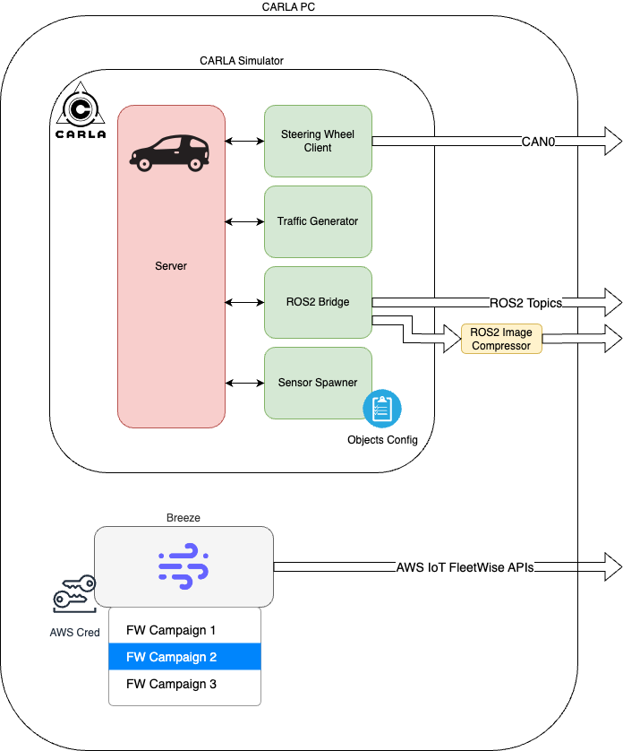

# ROS2-CARLA Bridge Setup Guide

Please follow the instructions from the project README.md before preforming these.

Also follow the following instructions to install (ROS2 Galactic)[https://docs.ros.org/en/galactic/Installation/Ubuntu-Install-Debians.html]

**System Architecture**



## Installation Steps

1. **Configure Environment Variables**

   Set up the necessary environment variables for Python and Carla:

   ```bash
   export CARLA_ROOT=/opt/carla-simulator/
   export PYTHONPATH=$PYTHONPATH:$CARLA_ROOT/PythonAPI/carla/dist/carla-0.9.13-py3.7-linux-x86_64.egg:$CARLA_ROOT/PythonAPI/carla
   source /opt/ros/galactic/setup.bash
   ```

2. **Install Additional ROS2 Packages**

   Clone and build additional ROS2 packages required for the bridge:

   ```bash
   mkdir -p ~/ros2_ws/src && cd ~/ros2_ws/src
   git clone https://github.com/astuff/astuff_sensor_msgs.git
   cd ~/ros2_ws
   colcon build --symlink-install
   source ~/ros2_ws/install/setup.bash
   rosdep install --from-paths src --ignore-src -r -y
   ```

3. **Build and Install carla-ros-bridge**

   Ensure that you have built and installed the `carla-ros-bridge` and all dependencies:

   ```bash
   cd ~/ros2_ws/src
   git clone https://github.com/carla-simulator/ros-bridge.git ros-bridge
   cd ros-bridge
   git submodule update --init --recursive
   rosdep update
   cd ..
   rosdep install --from-paths src --ignore-src -r -y
   sudo apt install python3-rosdep2
   colcon build --symlink-install
   ```

4. **Run the CARLA Server**

   We will be using lower rendering in order to increase FPS:

   ```bash
   /opt/carla-simulator/CarlaUE4.sh -no-rendering -quality-level=Low -prefernvidia

   ```

5. **Run the Client**

   To control the vehicle manually in the Carla simulator, run the client using:

   ```bash
   cd ~/carla-client
   source /opt/ros/galactic/setup.bash
   python3 manual_control_steeringwheel.py --sync --rolename ego_vehicle --filter vehicle.tesla.model3 -i can0
   ```

6. **Generate Traffic**
   ```bash
   python3 /opt/carla-simulator/PythonAPI/examples/generate_traffic.py -n 15 -w 20
   ```

7. **Run the ROS2 Bridge**

   Launch the ROS2 bridge with the Carla simulator:

   ```bash
   source /opt/ros/galactic/setup.bash
   source ~/ros2_ws/install/setup.bash
   ros2 launch carla_ros_bridge carla_ros_bridge.launch.py timeout:=20000 register_all_sensors:=false synchronous_mode:=false passive:=true
   ```

8. **Spawn Sensors Using Objects Definition File**

   Use the provided objects definition file to spawn all sensors:

   ```bash
   source /opt/ros/galactic/setup.bash
   source ~/ros2_ws/install/setup.bash
   ros2 launch carla_spawn_objects carla_spawn_objects.launch.py spawn_sensors_only:=True objects_definition_file:=ros2/objects.json
   ```

9. **Convert from raw to compressed Images**

   ```bash
   python3 ros2/image_converter.py --input_topic /carla/ego_vehicle/rgb_front/image --output_topic /carla/ego_vehicle/rgb_front/image_compressed
   python3 ros2/image_converter.py --input_topic /carla/ego_vehicle/depth_front/image --output_topic /carla/ego_vehicle/depth_front/image_compressed
   ```

10. **Start Breeze**

   ```bash
   python3 breeze.py
   ```

## (Optional) Start Up Script

Optionally, there is a `start.sh`` script that starts all the processes and ensures that if one of them dies, everything is closed properly. It can be used to start the demo.

```
# when using with real hardware
./start.sh -i can0 --use_steering_wheel
# otherwise
./start.sh -i vcan0
```

## Troubleshooting

If you encounter any issues, please ensure all environment variables are correctly set and that all dependencies are properly installed.
To inspect ros2 topics use the following commands:

```
source /opt/ros/galactic/setup.bash
ros2 topic list
ros2 topic echo <topic>
```
